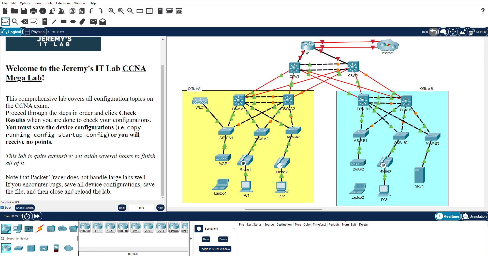

>**نکته**:
>ایده و فایل خام`pka.`این سناریو از [Jeremy's IT Lab](https://youtu.be/2p7-MluKAgE?si=PZIXJnTveFXlKFq1) برداشته شده‼️

# 🔻سناریوی CCNA Mega Lab

## 🔹محیط کار و توپولوژی

**Cisco Packet Tracer`9.0.1`⬆️

## 🔹هدف

- انجام دستورالعمل‌های داخل فایل`CCNA Mega Lab (Jeremy's IT Lab).pka`.
    
- **هدف** از این سناریو اینه که تمامی مباحث داخل CCNA رو به صورت یک جا تمرین کنیم!

## 🔹اقدامات و کانفیگ‌ها

### 🔸چک‌لیست

1. Part 1:
	- Step 1✅
	- Step 2⚠️(In the end!)
	- Step 3⚠️(In the end!)
	- Step 4⚠️(In the end!)
	
2. Part 2:
	- Step 1✅
	- Step 2✅
	- Step 3✅
	- Step 4✅
	- Step 5✅
	- Step 6✅
	- Step 7✅
	- Step 8✅
	- Step 9✅
	
3. Part 3:
	- Step 1✅
	- Step 2✅
	- Step 3✅
	- Step 4✅
	- Step 5✅
	- Step 6✅
	- Step 7✅
	- Step 8✅
	- Step 9✅
	- Step 10✅
	- Step 11✅
	- Step 12✅
	- Step 13✅
	- Step 14✅
	- Step 15✅
	- Step 16✅
	- Step 17✅
	- Step 18✅
	- Step 19✅
	
4. Part 4:
	- Step 1
	- Step 2
	
5. Part 5:
	- Step 1
	- Step 2
	
6. Part 6:
	- Step 1
	- Step 2
	- Step 3
	- Step 4
	- Step 5
	- Step 6
	- Step 7
	- Step 8
	- Step 9
	- Step 10
	- Step 11
	- Step 12
	- Step 13
	
7. Part 7:
	- Step 1
	- Step 2
	- Step 3
	- Step 4
	
8. Part 8:
	- Step 1
	- Step 2
	
9. Part 9:
	- Step 1
	- Step 2
	- Step 3
	- Step 4

### 🔸کانفیگ‌ها

## 🔹راستی آزمایی

## 🔹مشکل

- **مشکل**م 
    
- **راه‌حل**‌ش 

## 🔹نتیجه

>

